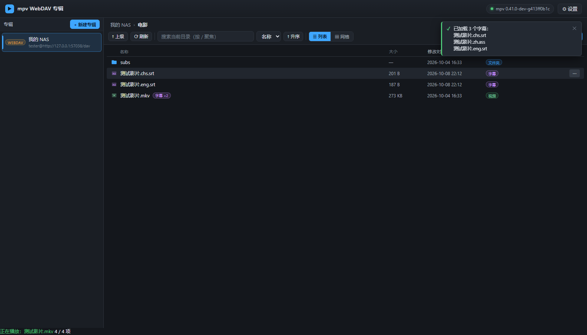
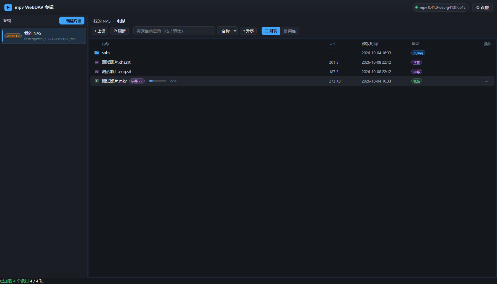

# mpv-webdav

一个跑在自己电脑上的小网页，像 PotPlayer 的「专辑」那样管理 **WebDAV** 上的影视库：
浏览目录 → 点一下视频 → **本机 mpv 直接播放**，**同目录 / 字幕子目录里的外挂字幕自动挂上**。

> **它是什么、不是什么**
>
> - 它**不是** Jellyfin / Emby / Plex 那类媒体服务器：不刮削、不转码、不建索引、不占服务器资源。
> - 它**不是**网页播放器：真正的播放器是**你本机的 mpv**，画质、硬解、字幕渲染、快捷键全部由 mpv 决定。
> - 它解决的是：WebDAV 上的片，怎么用**本机 mpv** 舒服地看——包括"选了哪条流""字幕编码乱码""外挂字幕挂不上"这些坑。
> - 与 mpv 官方、各网盘厂商均**无关联**，仅调用本机已安装的 mpv。
>
> 播放必须发生在**有桌面的本机**（mpv 要在交互式用户会话里运行），所以它天然是一个"本地小工具"，不是远程服务。

- 无需把文件下载到本地，也不需要把 WebDAV 挂载成磁盘
- 服务只监听 `127.0.0.1`，纯本地使用
- 零依赖：只用 Node.js 内置模块 + 原生前端，不用 `npm install`，不用打包
- 需要你自备 **Node.js 18+** 与 **mpv**（仓库不附带 mpv 二进制，放到 `mpv\mpv.exe` 或自己在设置里指定路径）



（上图为无头浏览器实测截图，用的是仓库里自动生成的测试样片：左侧专辑、中间目录列表、底部状态栏。）



（看过一半的视频会在列表里直接显示一条进度条 + 百分比——进度来自 mpv 自己的记录。）

---

## 1. 快速开始

需要 **Node.js 18+**（本机已是 v24）。

```bat
:: 方式一：双击 start.bat（自动打开浏览器）
start.bat

:: 不自动开浏览器 / 换端口
start.bat --no-browser
start.bat 9000
set MPV_WEBDAV_NO_BROWSER=1
start.bat

:: 方式二：命令行直接跑（不自动开浏览器）
node server\index.js            :: 默认 http://127.0.0.1:8787/
node server\index.js 9000       :: 指定端口
node server\index.js --open     :: 顺便打开浏览器

:: 方式三：npm
npm start
```

也可以 `pwsh -NoProfile -File .\start.ps1 -Port 8787`（`-NoBrowser` 同理）。

### 常驻托盘 + 开机自启（推荐日常使用）

```bat
:: 双击 start-tray.vbs —— 无黑窗，右下角出现托盘图标，服务在后台常驻
start-tray.vbs
```

托盘菜单：

| 菜单项 | 作用 |
| --- | --- |
| 打开控制台（双击图标同效） | 打开 <http://127.0.0.1:8787/> |
| 重启服务 | 优雅关闭再启动（数据不会丢） |
| 打开数据目录 / 查看日志 | 直接打开 `data\`、`logs\server.log` |
| **开机自启** | 勾选后登录即自动常驻 |
| 退出 | 优雅关闭服务（连同 mpv 一起收掉） |

开机自启也可以命令行设置：

```powershell
pwsh -NoProfile -File .\tools\autostart.ps1 -Status      # 看当前状态
pwsh -NoProfile -File .\tools\autostart.ps1 -Install     # 设置（在「启动」文件夹放一个快捷方式）
pwsh -NoProfile -File .\tools\autostart.ps1 -Uninstall   # 取消
```

说明：

- 托盘只是个「看门人」，服务本身还是同一个 `server\index.js`，日志写到 `logs\server.log`；
- 如果检测到 8787 上已经有服务在跑，托盘会**复用**它而不是再起一个；退出时也不会去关别人的实例；
- **不要**把它做成 Windows 服务：服务跑在 session 0，mpv 的窗口不会出现在你的桌面上，托盘图标也看不到；
- 托盘进程是单实例的，重复双击 `start-tray.vbs` 只会打开控制台，不会起第二份。

> 启动逻辑都在 Node 里（`server/index.js` 解析 `--open` / `--no-browser` / 端口），`start.bat` 只有 4 行，因此不会再受批处理换行符影响。

启动后浏览器会自动打开 <http://127.0.0.1:8787/>（`start.bat` 会；直接 `node` 运行时手动打开即可）。

## 2. 建一个 WebDAV 专辑

1. 左侧「专辑」→ **+ 新建专辑**
2. 填参数：

| 字段 | 说明 | 例子 |
| --- | --- | --- |
| 名称 | 随便起，只影响显示 | `家庭 NAS` |
| 类型 | 目前只支持 **WebDAV** | `WebDAV` |
| 服务器地址 | WebDAV 服务根地址，**必须以 `http://` 或 `https://` 开头** | 群晖 `http://192.168.1.10:5005/dav`<br>威联通 `https://nas:8081/dav`<br>Alist `http://192.168.1.10:5244/dav` |
| 根目录 | 从这个子路径开始浏览（默认 `/`） | `/影视/电影` |
| 用户名 / 密码 | WebDAV 账号；密码只存在本机 `data\albums.json` | |
| 认证方式 | `基本认证 basic`（默认）/ `摘要认证 digest` / `无认证 none` | 群晖常用 basic；部分老 NAS 用 digest |
| 忽略证书校验 | 自签名 HTTPS 证书时勾上 | |
| 高级 → 自定义请求头 | 每行一个 `Name: Value`，例如需要固定 `User-Agent` 时 | |

3. 点 **测试连接**，看到「连接成功：N 个文件夹 / M 个文件」即可 **保存**。
4. 点左侧专辑 → 中间出现目录 → 双击文件夹进入，双击视频播放。

> 常见 WebDAV 地址后缀：群晖 `/dav`、威联通 `/dav`、Alist `/dav`、Nextcloud `/remote.php/dav/files/<用户名>/`。

## 3. 播放与字幕

**双击整行**（或选中后按回车）= **从这一集开始连播本目录剩余**（剧集目录里就是"接着往下放"；
一行视频的目录里就等于只播它自己）。行尾 **⋯** 菜单里还有：从此集开始连播 / 只播这一集 / ↺ 从头播放 /
追加到播放列表 / 复制路径 / 复制名称。

连播规则：**同目录 + 同类型**（视频配视频、音频配音频），按**自然排序**（`第2集` 排在 `第10集` 前面），
从你点的那一集一直排到目录末尾，**整段一次性交给 mpv** —— 之后的"下一集"由 mpv 自己推进，网页不再同步队列；
每一集各自的字幕也会在入列时分别挂好。

**每个专辑会记住你上次浏览到哪个目录**（存在 `data/state/views.json`，条数 = 专辑数）：
再点这个专辑就直接回到那个目录，不用一层层点回去；如果那个目录已经不存在了，会自动退回专辑根目录并提示。
最近播放过的那一行还会带一个 **`上次`** 标记，方便接着看。

> **播放控制都在 mpv 自己的窗口里**：暂停（空格）、进度（←/→）、音量（9/0）、全屏（<kbd>f</kbd>）……
> 网页不再提供底部播放面板 —— 注意力在 mpv 上，网页只负责"选片、开播"。
> 网页里**没有任何播放控制**（连空格遥控也去掉了）；只保留一个只读的进度显示：浏览器标签页标题。

目录操作：**双击文件夹进入**（也可以点行内 **进入** 按钮，或选中后按回车），单击只做选中；
工具栏 **↑ 上级** 或点面包屑返回。

### 续播：交给 mpv 自己记（watch-later）

不再由本应用维护"看到哪了"的状态机 —— **进度是 mpv 自己写的**，我们只负责显示、删除和清理：

- 进度存在 `data/cache/watch-later/`，**每个看到一半的文件一条**（文件名 = 该流地址的 MD5）；
- 什么时候存由 mpv 决定：**停止 / 关窗口 / 退出 / 切集前**（我们会主动让 mpv 存一次，实测它自己不会在切集时存）；
- 播到结尾不留进度（=看完），下次自然从头开始；
- **列表里直接能看到进度**：看过一半的视频会在文件名后面显示一条小进度条 + 百分比（鼠标悬停显示"上次看到 12:34 / 共 45:00"）；只有"已看多少"、还没有总时长的会显示成 `已看 12:34`，我们会在后台用 mpv 快速补探一次总时长；
- 想从头看：该文件行尾 **⋯ → ↺ 从头播放**（会删掉那条进度，并用 `start=0` 明确压过续播）；
- 清理：超过「条数上限」（默认 200）或「天数上限」（默认 90 天）的自动清掉，可在设置里改，也能点「立即清理一次」；
- mpv 里按 **Shift+BACKSPACE** 可退回跳转前的位置；
- **关掉 mpv 或停止播放后，列表里的进度条会自动更新**（不用手动刷新页面），也不会再弹"mpv 已退出"之类没必要的提示。

> 因为进度是按**流地址**记的：**换端口或删掉 `data/state/instance.json` 会让已有进度失联**（重新生成令牌即可，代价只是旧进度找不到）。
> 另外 http 地址没有文件时间戳，所以"同一个路径换了文件"时 mpv 仍会按旧位置续播——这时候用「从头播放」即可。

### 和你直接用 mpv 打开文件：互不影响

本应用启动的 mpv 实例把进度目录**重定向**到 `data/cache/watch-later/`（`--watch-later-directory` + `--watch-later-options=start`），
而不是关掉这个功能——这样既让 mpv 记账，又和你自己的 mpv 完全分开：

| 场景 | 结果 |
| --- | --- |
| 你在资源管理器双击视频（mpv 是默认播放器） | 读写的是 mpv 自己的 `%APPDATA%\mpv\watch_later\`，**与本应用无关**，本应用也不会去读 |
| 本应用的续播 | 只读写 `data\cache\watch-later\`，外部 mpv 看不到、也不会改 |
| 两边同时开着 watch-later | 键天然不同：外部是本地路径 `C:\…` 的 MD5，本应用走的是 `http://127.0.0.1/…` 代理 URL，不会串 |
| 你 mpv.conf 里的设置 | 仍然生效；只有上面这几个跟进度有关的参数被我们显式指定 |

也就是说：**应用内外的播放进度完全隔离，互不影响**。

### 窗口行为：置顶 / 全屏 / 标签页进度

| 设置 | 默认 | 说明 |
| --- | --- | --- |
| 播放时把 mpv 窗口置顶 | **开** | 按下播放，mpv 窗口就在最前面，不用去任务栏找；**播放/暂停期间保持置顶，空闲（播完/停止）后自动取消**，不会有个空窗口一直挡着桌面 |
| 播放时自动全屏 mpv | 关 | 开启后按播放直接满屏（`--fullscreen`）；mpv 里按 <kbd>f</kbd> 仍可随时自己切换，本应用不会在播放中强行退出你的全屏 |
| 开始播放时把焦点交给 mpv | **开** | 按下播放后**直接按空格就能暂停**，不用先点一下 mpv 窗口（下面解释为什么需要单独做这件事） |
| 浏览器标签页显示进度 | 内置 | 标题变成 `▶ 0:12 / 45:00 · 影片名`，切到别的标签也能瞄一眼进度 |

这几个开关都在「设置」里，置顶 / 全屏改完立即生效（正在播放时会通过 IPC 实时作用到当前 mpv）。

> **为什么"置顶"还不够，还要单独要焦点？**
> 置顶只决定窗口的层级，**键盘输入仍然跟着"焦点"走**。你是在浏览器里点的播放，焦点还在浏览器上，
> 所以按空格会被网页（而不是 mpv）收到。
> 而从后台进程强行抢焦点会被 Windows 拒绝（实测 `AppActivate` 无效）；
> 现在的做法是让 **mpv 自己**把窗口"最小化→立刻还原"——进程激活自己的窗口系统一定允许，实测有效。
> 注意不能发完就不管：真实播放时窗口是刚建出来的，mpv 有时来不及处理还原命令（会停在最小化），
> 所以实现里每一步都**读回真实状态**，没还原就重试（最多 3 次）。

网页快捷键只剩"浏览"相关：`/` 搜索、回车进入选中项、上下键逐个选择。想清掉某条进度：该文件行尾 **⋯ → ↺ 从头播放**。

字幕规则（在「设置」里可改）：

- 扫描**视频所在目录**里所有字幕扩展名文件（`srt/ass/ssa/sub/idx/sup/vtt/smi/mks/pgs...`），按文件名匹配：
  - `影片.srt`（完全同名）优先
  - `影片.chs.srt`、`影片.zh-CN.ass`、`影片.eng.srt`（同名 + 语言后缀）
  - 其次是宽松前缀匹配
- 若同目录没有，再去 **字幕子目录**（默认 `subs`、`sub`、`subtitle`、`subtitles`、`字幕`）里找
- **目录级兜底**（默认开启）：上面都匹配不到时，如果该目录里**只有一个视频**，就把这个目录（含字幕子目录）里的全部字幕都挂给它。
  这条专治真实影视库里常见的情况：视频是发布组英文名（`Some.Movie.2012.1080p.BluRay.x264.mkv`），字幕却是中文片名（`某部电影 2012.Chs.ass`），文件名毫无共同前缀。
  可在「设置」里关闭。
- 排序参考 `slang`（默认 `zh,chi,zho,eng`），所以中文字幕会排在前面、默认选中
- **编码自动转 UTF-8**：中文影视库里的 `.srt/.ass` 很多是 GBK/GB18030（也有 BIG5/UTF-16），
  mpv 按 UTF-8 解出来就是 `ÎÒh»á¹yz` 这种乱码。服务端会先探测字幕编码、转成 UTF-8 再交给 mpv，
  所以你不需要手动配 `--sub-codepage`。可在设置里改成「不转换」或强制某个编码。
- 所有找的字幕都通过 `--sub-files-append` 交给 mpv，mpv 里按 `j`/轨道菜单可随时切换；mkv 内封字幕由 mpv 自行处理

播放由 mpv 完成，画质/硬解等参数在 **设置 → 附加 mpv 参数** 里写（每行一个），例如：

```
--hwdec=auto
--cache=yes
--profile=gpu-hq
```

`alang` / `slang` 默认 `zh,chi,zho,eng`，用于自动选择音轨和字幕。

## 4. 工作原理

```
浏览器 (http://127.0.0.1:8787)      Node 服务 (server/)                 mpv.exe
  │  专辑 / 浏览 / 播放控制            │                                    │
  ├─ /api/albums ───────────────────► data/albums.json                    │
  ├─ /api/browse ───────────────────► PROPFIND → WebDAV 服务器            │
  │                                    │  (basic/digest 认证, TLS 选项)     │
  ├─ /api/play ─────────────────────► 扫描同目录字幕                       │
  │                                    ├─ loadfile / 启动 mpv ────────────►│
  │                                    │   url = /stream/<token>/<album>/… │
  │                                    │        │                         │
  │                                    │        └─► 本地流代理 GET+Range ──┼─► WebDAV
  │◄─ /api/events (SSE 播放状态) ──────┤   命名管道 IPC 回传进度/控制 ◄─────┤
```

- **为什么要本地流代理**：mpv 直接播 WebDAV URL 会遇到「认证方式不统一、中文路径编码、需要自定义请求头」等问题。
  服务端统一处理认证并把字节流转给 mpv，mpv 只看见 `http://127.0.0.1:8787/stream/<一次性token>/...`，
  并且完整支持 HTTP `Range`（拖动进度条不会重新下载）。
- **两种播放通道**（自动选择，日志里会说明）：
  1. **IPC 模式（默认）**：常驻一个 mpv，用命名管道传 JSON 命令 → 支持播放列表、暂停/继续、拖动进度、音量、上一首/下一首，进度实时回显到网页。
  2. **回退模式**：命名管道不可用时（例如某些受限沙箱），改为每次点播启动一个 mpv 进程。
     播放和字幕完全一样，但拖动进度、暂停等远程控制不可用，「下一首」由服务端重启进程实现。

## 5. 目录结构

```
mpv-webdav/
├─ server/
│  ├─ index.js      HTTP 服务、API 路由、SSE、流代理
│  ├─ webdav.js     WebDAV 客户端：PROPFIND、basic/digest 认证、TLS、重定向、Range
│  ├─ xml.js        极简 XML 解析（解析 multistatus）
│  ├─ media.js      扩展名分类、字幕匹配与语言优先级
│  ├─ mpv.js        mpv 控制器（IPC + 回退双通道）
│  └─ store.js      专辑与设置持久化（data/*.json）
├─ public/          前端（原生 HTML/CSS/JS，无构建）
├─ data/            运行后生成：albums.json、settings.json
├─ mpv/             随工作区提供的 mpv
├─ tools/           测试与调试工具（见下）
├─ start.bat / start.ps1 / package.json
```

## 6. 设置项

| 设置 | 默认 | 说明 |
| --- | --- | --- |
| mpv.exe 路径 | `<项目>\mpv\mpv.exe` | 换成别的 mpv 也可以 |
| 视频 / 音频 / 字幕扩展名 | 常见集合 | 决定什么文件能被识别、播放 |
| 字幕搜索子目录 | `subs,sub,subtitle,subtitles,字幕` | 同目录找不到时再去这里找 |
| 单视频目录字幕兜底 | 开 | 目录里只有一个视频时，挂载该目录内全部字幕（中英文片名不一致时很有用） |
| 外挂字幕编码 | 自动检测并转 UTF-8 | 也可「不转换」（自己加 `--sub-codepage`）或强制 GB18030 / BIG5 / Shift_JIS |
| alang / slang | `zh,chi,zho,eng` | 音轨 / 字幕语言优先级 |
| 附加 mpv 参数 | 空 | 每行一个 |
| 默认音量 | 100 | 新开的 mpv 使用该音量 |
| 播放进度：最多保留条数 | 200 | mpv 的 watch-later 条目超过就按最近使用清理 |
| 播放进度：最多保留天数 | 90 | 超过天数没动过的进度自动清掉（0 = 不限制） |
| 播放时置顶 mpv | 开 | 播放/暂停期间置顶，空闲自动取消 |
| 开始播放时把焦点交给 mpv | 开 | 按下播放后可直接按空格暂停（关闭后需要手动点一下 mpv 窗口） |
| 播放时自动全屏 mpv | 关 | 开了就按播放直接满屏 |

## 7. 测试与自检

```bat
:: 端到端测试：mock WebDAV + 真实 mpv，验证浏览/认证/Range/播放/字幕
node tools\e2e-test.js

:: 要求必须走命名管道 IPC（普通桌面环境下跑）
node tools\e2e-test.js --require-ipc

:: 无头浏览器 UI 测试（需要 Chrome 或 Edge），并输出截图到 tools\.ui\
node tools\ui-test.js

:: 用 data\ 里已保存的专辑跑一遍真实界面点击（复制一份数据，不动原文件），截图到 tools\.uilive\
node tools\ui-live.js

:: 鼠标命中诊断：打印「点这个坐标会命中哪个元素」，用来排查"点了没反应/点错按钮"
node tools\probe-input.js --with-app --with-mock

:: 只想在本地试玩：起一个 mock WebDAV（密码 tester/secret）
node tools\mock-webdav.js --root tools\testdata --port 8899 --base /dav --auth basic --user tester --pass secret
:: 然后在网页里新建专辑：http://127.0.0.1:8899/dav

:: 生成测试样片（需要 ffmpeg 在 PATH，或传 -Ffmpeg <路径>）
powershell -NoProfile -File tools\make-testdata.ps1

:: 探测这台机器上 mpv 的 IPC 是否可用
node tools\probe-ipc.js

:: 验证专辑配置的自动备份 / 误删恢复（只操作 tools\.storetest）
node tools\store-test.js

:: 播放进度逻辑单测（md5 键、读写删、LRU 清理、旧进度迁移，不需要 mpv）
node tools\resume-test.js

:: data/ 目录结构、旧文件搬迁、固定令牌、进度上限（不需要 mpv）
node tools\state-test.js

:: 字幕编码：单元测试 + 对着真实服务器查某个字幕文件的编码
node tools\encoding-test.js
node tools\check-encoding.js --url https://nas.example.com:5006/dav --user <用户名> --pass <密码> --path "/影视/电影/xxx.ass"

:: 字幕渲染体检：同一帧渲染两次（原始 GBK vs 代理转 UTF-8），输出到 docs\
node tools\subtitle-render-check.js

:: 对着真实 WebDAV 服务跑一遍（建专辑→浏览→真播→检查 mpv 实际轨道/字幕）
node tools\live-check.js --url https://nas.example.com:5006/dav --user <用户名> --pass <密码> ^
     --path "/影视/电影/示例影片.2022/01.mp4" --seconds 8
::   --scan --depth 3              在这棵树里找「视频+外挂字幕」的目录并验证挂载
::   --headless 默认开：mpv 用 --vo=null --ao=null，不弹窗不出声；加 --no-headless 可看真实播放
```

`tools/testdata` 里是自动生成的测试素材（小视频 + 中文字幕，含中文名与 `subs/` 子目录场景）。**整个目录都是生成的、不进仓库**，跑 `e2e` / UI 测试前先执行一次 `npm run testdata`（缺素材时测试会直接提示这一句）。

> 所有测试脚本都会**动态分配端口**，并在启动后断言"连到的是本次测试自己的实例"（端口一致、专辑列表符合预期），
> 否则立即中止、不做任何修改——因此不会占用你正在使用的 `8787`，也不会写你的 `data/`（`ui-live` 只读取 `data/` 的副本）。

## 8. 常见问题

**Q：点播放没反应 / 提示找不到 mpv.exe**
在「设置」里把 mpv.exe 路径填对（默认是项目目录下的 `mpv\mpv.exe`，也可以指向你自己装的 mpv）。顶栏的 mpv 状态药丸会显示是否检测到。

**Q：测试连接报 401**
账号密码或认证方式不对。先试 `basic`，不行再试 `digest`，或确认该 WebDAV 路径是否需要开「允许 HTTP 访问」。

**Q：报 TLS 证书错误**
自签名证书时勾选「忽略证书校验」。

**Q：服务能浏览但播放失败**
1. 看服务端控制台的错误输出；
2. 有些 WebDAV 服务不支持 `Range` 或对大文件有限制，可在专辑高级里加请求头；
3. 确认 mpv 能在命令行播放该流：脚本会在 `tools\.e2e\mpv.log` 留下 mpv 自己的日志。

**Q：网页显示了「已切换轮询模式」**
SSE 被浏览器/代理打断，已自动降级为每 2 秒轮询，功能不受影响。

**Q：网页上怎么没有播放/暂停和进度条？**
故意的：播放控制（暂停、进度、音量、快捷键）都在 **mpv 自己的窗口**里，网页只负责"选片、开播"。
网页里连键盘遥控都没有了（只有浏览用的 `/` 搜索、回车进入、上下选择）；浏览器标签页标题会显示 `▶ 0:12 / 45:00 · 影片名`。
如果当前是**回退模式**（命名管道 IPC 不可用），seek / 下一首这类控制本身也不可用；可用 `node tools\probe-ipc.js` 确认。

**Q：点文件夹进不去 / 点了没反应**
单击文件夹只会选中（高亮），**双击**才进入；也可以点行内 **进入** 按钮，或选中后按回车。
若双击仍无反应，看底部状态栏的错误信息（多为路径权限或服务器返回错误），可用 `node tools\live-check.js …` 直接对服务器验证。

**Q：点专辑名却弹出了「编辑专辑」**
已修复：悬停时出现的操作按钮（编辑/测试连接/删除）现在只覆盖专辑条目第二行的地址区，不会再压住专辑名。

**Q：新建专辑填到一半，点到弹窗外就没了**
已修复：点遮罩不再关闭对话框；只有显式点「取消 / ✕」或用 Esc（且表单有改动时会先弹确认）才会关闭。

**Q：外挂字幕显示成 `ÎÒh»á¹yz` 这类乱码**
字幕文件的编码不是 UTF-8（多为 GBK/GB18030，也有 BIG5），mpv 按 UTF-8 解就是乱码。
本应用**默认会自动探测并转成 UTF-8 再交给 mpv**，所以先确认你重启过服务（后端改动需要重启，改动前的老进程没有这个能力）；
如果某些文件仍然乱码，可在「设置 → 外挂字幕编码」里强制指定（如 GB18030 或 BIG5）。
也可以先用 `node tools\check-encoding.js --url <WebDAV> --user <用户> --pass <密码> --path <字幕路径>` 看它到底是什么编码。

想自己拿 mpv 直接播（不走本应用）时，加参数 `--sub-codepage=gb18030` 即可。

**Q：能不能把 mpv 的画面嵌到网页里（一个窗口里既浏览又播放）？**
不建议，也做不到"既嵌入又保留 mpv 画质"，原因很硬：

- **网页自己播 `<video>`**（Jellyfin/Emby 的做法）→ [浏览器支持的容器](https://developer.mozilla.org/en-US/docs/Web/Media/Guides/Formats/Containers)里没有 MKV，DTS/TrueHD 音轨、PGS/VOBSUB 图形字幕、ASS 特效字幕都不支持；想覆盖就得**服务端转码**，画质和性能都要付代价。
- **Electron/Tauri + `--wid`**（把 mpv 渲染塞进自有窗口）→ 只有自己拥有窗口的应用才拿得到 HWND；而且视频是**子窗口覆盖**而不是 DOM，焦点/键盘要自己转发，**全屏会有两套体系打架**。
- **画面串流到浏览器**（云游戏那套）→ 额外编解码、延迟、画质损失，为了省一次 Alt+Tab 不值得。

本应用选的是"**网页选片、mpv 播放**"：控制都在 mpv 窗口里，网页只负责浏览与开播，另加一个只读的标签页进度。
想要"按播放就能看到画面"，用上面的**置顶**（默认开）+ 需要时打开**自动全屏**即可。

**Q：端口被占用**
`node server\index.js 9000` 或 `start.bat 9000` 换端口。

**Q：运行 `start.bat` 报 `'""' 不是内部或外部命令` / `'8787"' 不是内部或外部命令`**
批处理文件被存成了 **LF 换行**（很多编辑器/工具默认如此），而 cmd.exe 解析 `if ... set` 需要 **CRLF**。仓库里的版本是 CRLF；如果被改坏，用记事本另存为 CRLF，或执行一次：

```powershell
$p='start.bat'; [IO.File]::WriteAllText($p, ([IO.File]::ReadAllText($p) -replace "`r`n","`n" -replace "`n","`r`n"))
```

## 9. 数据文件与备份

**`data/` 是你的数据目录，不要删。** 里面分三类，越用越不会乱：

| 路径 | 类别 | 能删吗 | 内容 |
| --- | --- | --- | --- |
| `data/albums.json`（+`.bak`） | 配置 | **不能删** | 你建的所有专辑（**密码是明文**，因为服务要用它登录 WebDAV） |
| `data/settings.json`（+`.bak`） | 配置 | **不能删** | 设置项 |
| `data/state/instance.json` | 状态 | 建议别删 | 固定的流地址令牌；删了会重新生成（旧进度会失联） |
| `data/state/views.json` | 状态 | 能删（只丢"上次浏览到哪"） | 每个专辑最后浏览的目录 + 最近播放的文件 |
| `data/state/recent.json.bak` | 状态 | 能删 | 升级前那版"自管进度"的备份（已不再使用，仅作留念/手工恢复） |
| `data/cache/watch-later/` | 缓存 | **随便删** | 播放进度（mpv 自己写的，每个看到一半的文件一条） |
| `data/cache/durations.json` | 缓存 | **随便删** | 每个文件的总时长（为了把进度画成进度条；跟着进度条目一起清理） |
| `data/cache/` 其它 | 缓存 | **随便删** | 其它临时/缓存文件 |

规则：**任何要落盘的东西只能放进这三类之一，并且必须有上限或清理方式**；`data/` 根目录只放配置文件。

- 每次保存前，程序会先把现有文件另存为 `.bak`；
- 启动时如果 `albums.json` **被删掉或写坏了**，会自动从 `.bak` 恢复并在控制台提示，恢复后重建主文件；
- 所以最坏情况下你只会丢掉"最后一次修改"，不会丢掉整个专辑列表；
- 旧版本自己记的进度（`data/last-played.json` / `data/state/recent.json`）会在启动时**转成 mpv 的进度条目**，然后删掉那个快照文件（内容已经搬进 `cache/watch-later/`，不会丢）；
- 想手动兜底的话，直接复制一份 `data\albums.json` 到别处即可（`node tools\store-test.js`、`node tools\state-test.js`、`node tools\resume-test.js` 可以验证上面这些行为）。

## 10. 安全与隐私

- 服务**只监听 `127.0.0.1`**，局域网内其它机器访问不到。
- 流代理地址带一个**固定的**令牌（存在 `data/state/instance.json`，首次启动生成、之后不变）。它**不是**安全边界（本机进程本就能调用本机接口），作用是不让浏览器里其它网页顺手读取你的 NAS 内容；把令牌固定下来是为了让 mpv 的播放进度记录能长期有效——进度是按流地址记录的，**换端口或删掉 `instance.json` 会让已有进度失联**。
- 专辑密码以**明文**保存在 `data\albums.json`（仅本机），因为服务需要用它去登录 WebDAV；接口不会把密码回传给前端。若要更保险，请给 `data` 目录设置好本机访问权限，或使用 WebDAV 的只读专用账号。
- 建议使用 HTTPS 的 WebDAV 地址，避免密码明文过网。
